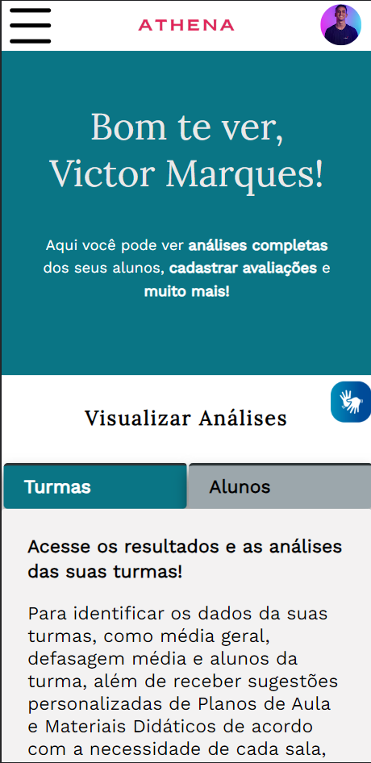

# Inteli - Instituto de Tecnologia e Liderança 

<p align="center">
<a href= "https://www.inteli.edu.br/"></a>
</p>

# Athena

## Equipe Prometheus

## Integrantes: 
<div align="center">
  <table>
    <tr>
      <td align="center"><a href="https://www.linkedin.com/in/victor-marques-profile/"><br><sub><b>Victor M.</b></sub></a> <br></td>
      <td align="center"><a href="https://www.linkedin.com/in/davi-ferreira-arantes/"><br><sub><b>Davi A.</b></sub></a></td>
      <td align="center"><a href="https://www.linkedin.com/in/marcela-issa-838674268/"><br><sub><b>Marcela I.</b></sub></a></td>
      <td align="center"><a href="https://www.linkedin.com/in/raissa-moraes-a89179264/"><br><sub><b>Raissa C.</b></sub></a></td>
    </tr>
  </table>
</div>

<div align="center">
  <table>
    <tr>
      <td align="center"><a href="https://www.linkedin.com/in/pedro-auler-a3b23021a/"><br><sub><b>Pedro A.</b></sub></a> <br></td>
      <td align="center"><a href="https://www.linkedin.com/in/marcelomiguelassis/"><br><sub><b>Marcelo A.</b></sub></a></td>
    </tr>
  </table>
</div>

## 📝 Descrição

<div align="center">
  <sub>Página principal na versão mobile</sub><br>

  
</div>

Este projeto nasceu de uma colaboração entre o Inteli e a organização Nova Escola, cujo principal objetivo é a construção de um sistema que apoie professores da rede pública no diagnóstico da aprendizagem dos seus estudantes e que recomende conteúdos pedagógicos após a avaliação. Nesse viés, a equipe Prometheus, a partir dessa meta, construiu a *Athena*. 

A *Athena* é uma aplicação web que fornece o gerenciamento prático, acessível e dinâmico das turmas, das avaliações e dos alunos do professor utilizador. Nela, o usuário pode identificar quais as principais dores de cada turma e aluno, a partir da submissão de dados das avaliações.

Através desses dados, a aplicação fornece gráficos intuitivos para o acompanhamento da aprendizagem dos seus alunos, além de recomendar conteúdos pedagógicos (planos de aulas criados pela Nova Escola) para o professor, de acordo com as dificuldades identificadas.

## 📁 Estrutura de pastas


|--> documentos<br>
  &emsp;| --> outros <br>
  &emsp;| --> frontend <br>
  &emsp;| --> backend <br>
  &emsp;| T06_G4_V0.3.0_Web_application_document.pdf<br>
  &emsp;| T06_G4_V0.3.0_Web_application_document.docx<br>
|--> imagens<br>
|--> src<br>
  &emsp;|--> controllers<br>
  &emsp;|--> data<br>
  &emsp;|--> models<br>
  &emsp;|--> routes<br>
  &emsp;|--> views<br>
| README.md<br>
| LICENSE

Dentre os arquivos presentes na raiz do projeto, definem-se:

- <b>README.md</b>: arquivo que serve como guia e explicação geral sobre o projeto (o mesmo que você está lendo agora).

- <b>documentos</b>: aqui estarão todos os documentos do projeto. Há também uma pasta denominada <b>outros</b> onde estão presentes aqueles documentos complementares ao <b>web application document</b>.

- <b>imagens</b>: imagens relacionadas ao projeto como um todo (por exemplo imagens do sistema, do grupo, logotipos e afins).

- <b>src</b>: nesta pasta encontra-se todo o código fonte do sistema (existem outras subpastas: <b>controllers</b>, <b>data</b>, <b>models</b>, <b>routes</b>, <b>views</b> que representam a implementação do padrão de projeto MVC, na qual as rotas direcionam para o controlador, que chamam os modelos, os quais retornam os dados para as views (páginas) por meio do banco de dados (data)).

## 💻 Configuração para desenvolvimento

Aqui encontram-se todas as instruções necessárias para a instalação de todos os programas, bibliotecas e ferramentas imprescindíveis para a configuração do ambiente de desenvolvimento.

1.  Baixar e instalar o node.js:  [https://nodejs.org/pt-br/](https://nodejs.org/pt-br/) (versão 16.15.1 LTS)
2. Clone o repositório em questão.
3.  No modo administrador, abra o "prompt de comando" ou o "terminal" e, após,  abra a pasta "src/backend" no diretório raiz do repositório clonado e digite o segundo comando:

```sh
npm i
```

Isso instalará todas as dependências definidas no arquivo <b>package.json</b> que são necessárias para rodar o projeto. Agora o projeto já está pronto para ser modificado. Caso ainda deseje iniciar a aplicação, digite o comando abaixo no terminal:

```sh
npm start
```
5. Agora você pode acessar a aplicação através do link http://localhost:3000/
6. O servidor está online.

## 🗃 Histórico de lançamentos

* **1.0.0** - 23/06/2023
    * Integração com o sistema do Google para login e cadastro de novos professores na aplicação;
    * Criação dos gráficos de média e de avaliação na página das turmas;
    * Sistema para upload e carregamento dinâmico da foto de perfil do professor.
* 0.9.0 - 21/06/2023
    * Padronização da estilização do css;
    * Melhoria do *dark mode* para desktops.
* 0.8.0 - 16/06/2023
    * Sistema de recomendação de planos de aulas;
    * Responsividade de todas as páginas para desktop;
    * Adição de novas validações de acesso.
* 0.7.0 - 09/06/2023
    * Integração de todas as páginas da versão 0.6.0 com os respectivos controladores e modelos do back-end;
    * Implementação do DAO - Data Access Object.
* 0.6.0 - 04/06/2023
    * Adição das telas de cadastrar, editar e listar turmas;
    * Adição das telas de cadastrar, editar e listar assuntos de avaliação;
    * Adição da tela de cadastrar avaliação;
    * Adição da tela de inserir resultados;
    * Adição das telas de cadastrar e editar alunos.
* 0.5.1 - 26/05/2023
    * Correção da semântica da página de login;
    * Adição da página inicial (mobile e desktop);
    * Adição da tela de perfil (mobile e desktop);
    * Adição da tela de cadastro (mobile e desktop);
    * Padronização do css;
    * Renderização das páginas no servidor;
    * Adição de validações nos endpoints de alunos.
* 0.4.0 - 18/05/2023
    * Endpoints (CRUD) das tabelas bloco de questão e notas;
    * Validações nas requisições contra SQL Injection;
    * Adição de feedbacks nas requisições incorretas (bloco de questão e notas).
* 0.3.0 - 17/05/2023
    * Primeira versão da página de login (mobile e desktop);
    * Estruturação do modelo MVC - Model, Views e Controllers.
* 0.2.0 - 12/05/2023
    * Criação dos modelos conceitual, lógico e físico do Athena DB;
    * Endpoints (CRUD) de turmas, professores, alunos, áreas do conhecimento e disciplinas;
    * Documentação dos testes da API via postman;
    * Wireframe desktop da aplicação.
* 0.1.0 - 28/04/2023
    * Criação do wireframe mobile da aplicação.

## 📋 Licença/License

<p xmlns:cc="http://creativecommons.org/ns#" xmlns:dct="http://purl.org/dc/terms/"><a property="dct:title" rel="cc:attributionURL" href="https://github.com/Spidus/Teste_Final_1">MODELO GIT INTELI</a> by <a rel="cc:attributionURL dct:creator" property="cc:attributionName" href="https://inteli.edu.br/">Inteli, Davi Ferreira Arantes, Marcela Issa Avila Vieira Alves Martins, Marcelo Miguel Pereira de Assis, Pedro Auler de Barros Martins,Raissa de Cássia Moraes Paula, Victor Gabriel Marques</a> is licensed under <a href="http://creativecommons.org/licenses/by/4.0/?ref=chooser-v1" target="_blank" rel="license noopener noreferrer" style="display:inline-block;">Attribution 4.0 International</a>.</p>

## 🎓 Referências

Aqui estão as referências usadas no projeto:

1. <https://creativecommons.org/share-your-work/>
2. <https://developer.mozilla.org/en-US/docs/Glossary/MVC>
3. <https://www.oracle.com/java/technologies/data-access-object.html>
